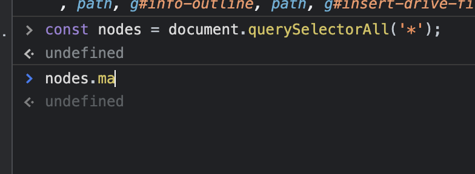

# 다형성

> 기본 Array 내에 map, filter 등 다양한 메서드들이 존재하는데 왜 굳이 별도의 함수를 만들어야 하는가?

## 메서드 vs 함수

- 메서드는 기본 객체에 의존적. 따라서 순수함수라고 부를 수 없음
- 아래와 같이 Array가 아닌 iterable한 자료구조에는 `filter, map` 등 기본 메서드 없음
  

```javascript
[1, 2, 3, 4].filter((val) => val % 2); // result: [1, 3]
document.querySelectorAll("*").map((node) => node.nodeName); // 함수 없다고 나옴
```

- 따라서 iterable한 자료구조에 기능을 사용하기 위해 `map, filter`와 같은 함수로 만들어 사용. ex) loadash
