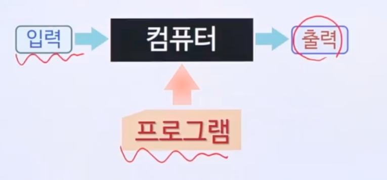

# 1강

## 컴퓨터란?

- 데이터 처리기(data processor)?

  - 기능적 측면만 강조 (입력-처리-출력)
    - 계산기는 컴퓨터인가? 아님.
  - 너무 포괄적인 정의
  - 어떤 형태의 작업을 처리할 수 있는지 불분명

- **프로그램이 가능한 데이터 처리기**
  

## 프로그램

- 컴퓨터가 데이터를 어떻게 처리할지를 알려주는 일련의 명령어 집합
- 처리 가능한 작업의 유형과 연산의 집합을 결정
  - 컴퓨터 > 특수 목적의 작업을 처리하는 기계가 아니라, "다양한 형태의 작업을 수행할 수 있는 범용의 기계"
