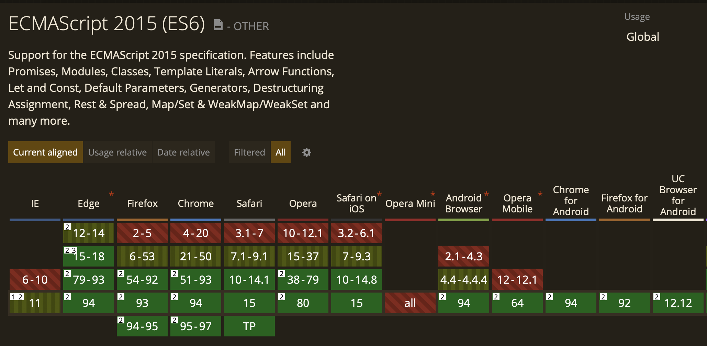

# webpack이란?

## bundler란?

webpack은 parcel, rollupjs 등 다양한 종류의 bundler 중 하나입니다. 그럼 bundler는 무엇이고, 왜 필요할까요?

- JavaScript는 모듈 자체적으로 모듈을 지원하지 않습니다.
- 웹 서비스 구조가 복잡해짐에 따라 코드 구조화, 모듈화가 필요해졌습니다. 따라서 `CommonJS`, `AMD(Asynchronous Module Definition)` 를 걸쳐 현재 가장 많이 사용되는 ESM(ES Module)와 같은 모듈 시스템이 생기게 되었습니다.
- 과거 브라우저는 모듈 시스템을 지원하지 않기 때문에 웹팩과 같은 번들러를 이용해 모듈화된 코드를 브라우저에서 실행할 수 있는 정적파일 형태로 변환시켜야 합니다. 단, 현재는 대부분의 브라우저가 `ESM`을 자체지원합니다.[^1]

## webpack 기능 및 개념

### Entry

모듈에 관한 의존성 그래프를 만들고 하나의 파일로 만들기 위한 시작 파일을 지정하기 위한 옵션입니다.

```json
entry: {
'**/entryPath1': ['./src/path/to/entry1.ts', './src/path/to/entry1.scss'], // 에디터
    	// ...
    },
```

### Output

번들된 파일의 위치, 이름 등 기타 설정에 관한 옵션입니다. 아래와 같이 설정할 경우, `/build/libs/` 경로에 스크립트 파일이 결과물로 만들어져 있습니다.

```json
output: {
path: path.resolve(\_\_dirname, "build", "libs"),
publicPath: "/libs/",
chunkFilename: isLocalDev ? "[name].chunk.js" : "[chunkhash].chunk.js",
// chunkFilename: "[name].[hash].chunk.js",
filename: '[name].js'
},
```

## Loader(Loader랑 plugin이랑 도대체 뭐가 다를까? )

여러 파일 형식을 모듈로 사용할 수 있도록 변환하는 옵션입니다.

- test: 어떤 파일을 처리할지 지정합니다.
- use: 어떤 로더를 사용하여 어떻게 처리할지를 결정합니다.

1.  babel-loader

    - `JavaScript` 처리에 많이 쓰이는 loader는 `babel-loader`가 있습니다.
    - `babel-loader`는 `TypeScript`, `Javascript` 변환, 브라우저 호환용 타깃 지정 등의 다양한 기능을 갖고 있습니다.
    - 그럼 브라우저 호환 기능이 왜 필요할까요? 다음의 상황을 예시를 보면 쉽게 이해할 수 있습니다.
      
      ex) IE 11 등 오래된 브라우저는 ES6을 지원하지 않는습니다. 따라서 babel-loader가 ES3 기준으로 Javascript를 transpiling이 필요합니다.

    - babel-loader에 대표적으로 jsx 관련 플러그인이 있습니다.
      ex) babel-plugin-transform-react-jsx, jsx → js transpiling

2.  sass-loader

- `_.scss File` →  `_.css` File로 컴파일해주며, js에 module로써 import를 가능하게 해줍니다.

3. css-loader

- `\*.css` file을 module로써 js에 Import (load) 할 수 있다.

## Plugin

Loader는 모듈화에 대한 처리를 하는 반면 Plugin은 그외 다양한 처리를 할 수 있습니다. 특히 빌드 결과물에 대한 처리(번들 최적화), 환경변수 주입, 빌드 과정에 대한 처리를 도와줍니다.

1. ForkTsCheckerWebpackPlugin
   TypeScript를 처리할 수 있는 방법은 두 가지 입니다.

- `ts-loader` 이용하여 타입 정의 파일, 정적 타입 체킹을 빌드 시에 같이 하게 합니다.
- `ts-loader`에 `transpileOnly` 옵션을 주거나, `babel-loader`를 사용하는 경우, TypeScript 처리해주는 플러그인을 사용하여 transpiling 만 하도록 하고, `ForkTsCheckerWebpackPlugin`을 사용하여 별도의 쓰레드에서 타입 체킹하게 합니다. 프로젝트가 규모가 커질수록 빌드 시간이 오래걸리므로 이 방법을 권장합니다.

2. HtmlWebpackPlugin
   웹팩으로 만들어진 번들을 서빙하기위한 HTML파일을 생성해줍니다. 해시 값 등 가변적인 HTML 파일 이름을 사용해야하는 경우에 사용합니다. 아래처럼 `ejs` 템플릿 파일 경로와 결과 파일 이름을 플러그인에 제공하면 플러그인이 자체 제공하는 `ejs` 템플릿 엔진으로 HTML파일을 만들어 줍니다.

```json
  module.exports = {
  getView: (param) => {
  const outputEntryList = [];
  // 메인페이지
  outputEntryList.push({
    filename: 'main/main.html',
    template: 'src/main.ejs',
    data: {
        buildHash: param.buildHash
    }
  });
        // ...
          return outputEntryList;
      }

};

    viewConfig.getView({}).forEach(ejsEntry => {
    plugins.push(new HtmlWebpackPlugin({
    filename: (ejsEntry.outputLibs === true ? '' : '../views/') + ejsEntry.filename,
    template: ejsEntry.template,
    templateParameters: (compilation, assets, options) => ejsEntry.data != null ? ejsEntry.data : {},
inject: false,
}));
});
```

3. MiniCSSExtractPlugin
   css file이 js에 Import 되어 사용될 경우(css module import), on-demand로 css file load 가능합니다.

## 웹팩 성능 개선하기

https://webpack.js.org/guides/build-performance/
https://webpack.js.org/blog/2020-10-10-webpack-5-release/#persistent-caching
로더를 필요한 디렉토리에서만 사용하기
빌드 결과물 크기를 줄이기
라이브러리 의존을 줄인다.
chunk를 잘 나눈 뒤 비동기 처리한다.
안쓰이는 코드를 제거한다.
변경된 부분만 컴파일한다.
메모리에 올려 컴파일하기 (Hot Module Reloading)
적절한 Devtool(소스맵) 사용하기
TypeScript를 쓰는 경우 타입 체킹은 ForkTsCheckerWebpackPlugin이용하기.

https://slack.engineering/keep-webpack-fast-a-field-guide-for-better-build-performance/
병렬 처리
parallel-webpack을 이용하여 병렬로 빌드 실행
happypack을 이용하여 병렬로 loader 실행
UglifyJSPlugin의 parallel option사용
계산 부하 줄이기
Minification을 최소화하기
똑같은 코드가 여러번 import되지 않게 하기
webpack Bundle Analyzer 과 Bundle Buddy을 이용하여 중복되는 부분을 찾고 CommonsChunkPlugin를 이용하여 chunk를 공유하도록 쪼갠다
다른 파일을 참조하는 경우가 없는 파일은 파싱에서 아예 제외시키기
autodll-webpack-plugin을 이용하여 한번 빌드된 번들을 재사용하도록 하기.
적절한 소스맵 사용하기
빌드 캐시 사용하기
cache-loader
babel-loader을 사용하는 경우 built-in caching
빌드하는 하드웨어의 성능에 투자하기

다른 관련 문서
https://blog.box.com/how-we-improved-webpack-build-performance-95
https://survivejs.com/webpack/optimizing/performance/

[^1]: [JavaScript modules - JavaScript](https://developer.mozilla.org/ko/docs/Web/JavaScript/Guide/Modules)
