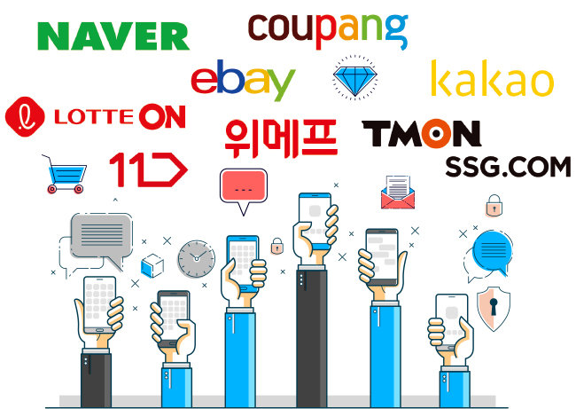
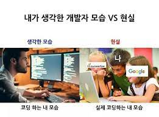

# 1 week

---

## 저는 '모르고리즘' 입니다.

우선 제 닉네임의 기원부터 말하자면...
취업 준비하던 몇 년전, 알고리즘 스터디를 하는데
친구가 제가 푼 해결책을 보고...

### "야이씨~ 이건 '알고'리즘이 아니다.'모르고'리즘이다."

제 닉네임 탄생의 기원에는 슬픈 전설이 깃들어 있었습니다...

---

## 반가워요👋

## 저도 부트캠프(~~강남 f*st 뭐시기..~~) 출신이에요~

---

---

## 보유하고 있는 기술 스택 

---

## 아이엠그라운드 자기소개 시작!

---

### 1. 현재 Front-end 개발 공부를 하고 있는 이유

### 2. 취업하고 싶은 회사 혹은 관심 있는 산업 영역(도메인)

- ex) NAVER, 배달의 민족, 커머스 분야, 미디어 분야 등

### 3. 멘토링 시간에 함께 이야기했으면 하는 주제

- ex) 비전공자 공부법, 괜찮은 회사란 무엇인가, 기술 스택 공부 등

---
# 성공하는 프로젝트를 위한 주의사항
---
### 0. 항상 명심해야할 것은 프로젝트의 가장 중요한 점은 완성된 결과물을 보는 것
- 코드 퀄리티도 함께 챙기면 좋겠지만, 여러분은 신입 개발자 입니다!
### 1. 익숙한 스택으로 프로젝트 구성하기
- 지금 해야할 프로젝트는 배운 것을 응용해보는 시간!
- 프로젝트와 병행하면서 새로운 스택을 학습하기란 매우 쉽지 않음

### 2. 프로젝트 팀원 간의 규칙 정하기
- 팀원 간의 약속을 어길 시의 소정의 벌금을 낸다거나...
- 이견 발생 시, 빠르게 논의하기 위한 방법을 고민한다거나...
- 비대면 회의 시, 항상 화상 회의를 한다거나..

___

### 3. 팀원들과 많이 친해지세요!
- 케미가 프로젝트 결과에 많은 영향을 미칩니다.
- 앞으로 같은 업계에서 함께 할 동료이기도 합니다.

