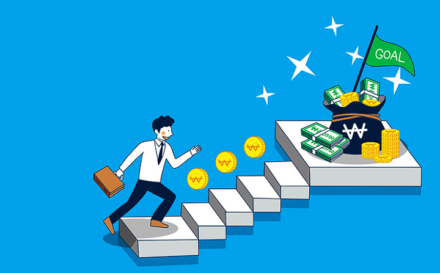

# 1 week: 알아가기

---

## 반가워요👋, 저는 '모르고리즘' 입니다.

우선 제 닉네임의 기원부터 말하자면...
취업 준비하던 몇 년전, 알고리즘 스터디를 하는데
친구가 제가 푼 해결책을 보고...

### "야이씨~ 이건 '알고'리즘이 아니다. '모르고'리즘이다."

제 닉네임 탄생의 기원에는 슬픈 전설이 깃들어 있었습니다...

---

## 저도 부트캠프(~~강남 f*st 뭐시기..~~) 출신이에요~

---
## 부트캠프를 간 이유?
무언가를 창조하고 싶은 욕구가 항상 있었어요.
그래서 무언가를 '만드는' 직업을 하고 싶었어요.

---

---
## 기술 스택
- language: javascript, typescript
- framework(library): react, vue

- bundler: webpack, rollup
- style: css, scss(sass), styled-component
- server:  node.js(아주 간단하게)
---
## 멘토링에 참여한 이유?
작지만 제가 경험한 것들을 나누고 싶었어요.
무엇보다 쉽지 않은 결정을 통해 힘든 과정을 겪고 있는 것을 응원해주고 싶었어요.

---

## 최근 관심사

### 👨‍💻 함수형 프로그래밍
### 🇪🇸 스페인, 🇵🇹포르투갈 여행
### 💸 재테크

---

## 아이엠그라운드 자기소개 시작!

---
1. **요즘 관심 갖고 있는 세 가지(개발 관련 아니여도 됩니다!)**
   - ex) 뉴진스, 에스파, 르세라핌 

2. **현재 Front-end 개발 공부를 하고 있는 이유**
   - ex) 취업, 단순 지식 습득 등 

3. **(취업이 목적이라면) 취업하고 싶은 회사 혹은 관심 있는 산업 영역(도메인)**
   - ex) NAVER, 배달의 민족, 커머스 분야, 미디어 분야 등
4. **멘토링 시간에 함께 다루길 바라는 주제**
   - ex) 비전공자 공부법, 괜찮은 회사란 무엇인가, 기술 스택 공부, 나는 이대로 가도 괜찮은가? 등

---
# 프로젝트 성공(완성)을 위한 주의사항!
~~부트캠프 시절, 망하는 프로젝트를 참 많이 봤습니다...~~

---
1. **프로젝트 완성 >= 코드 퀄리티 > 기획 === 디자인**
   -  여러분은 신입 개발자 입니다!
   - 기획, 디자인은 기본만 하면 됩니다.
     - 기획이 정해진 후, 되도록이면 바꾸지 마세요. 

--- 

2. **익숙한 스택으로 프로젝트 구성하기**
   - 지금 해야할 프로젝트는 배운 것을 응용해보는 시간!
   - 프로젝트와 병행하면서 새로운 스택을 학습하기란 매우 쉽지 않음

___

3. **프로젝트 팀원 간의 규칙 정하기**
   - 팀원 간의 약속을 어길 시의 소정의 벌금을 낸다거나...
   - 이견 발생 시, 빠르게 논의하기 위한 방법을 고민한다거나... 
   - 비대면 회의 시, 항상 화상 회의를 한다거나..

---

4. **팀원들과 많이 친해지면 좋아요!**
   - 케미가 프로젝트 결과에 많은 영향을 미칩니다.
   - 앞으로 같은 업계에서 함께 할 동료이기도 합니다.

--- 

## 그럼 앞으로 잘부탁드립니다🙏
## 1달 동안 서로 성장하는 시간을 만들어봐요🚀

