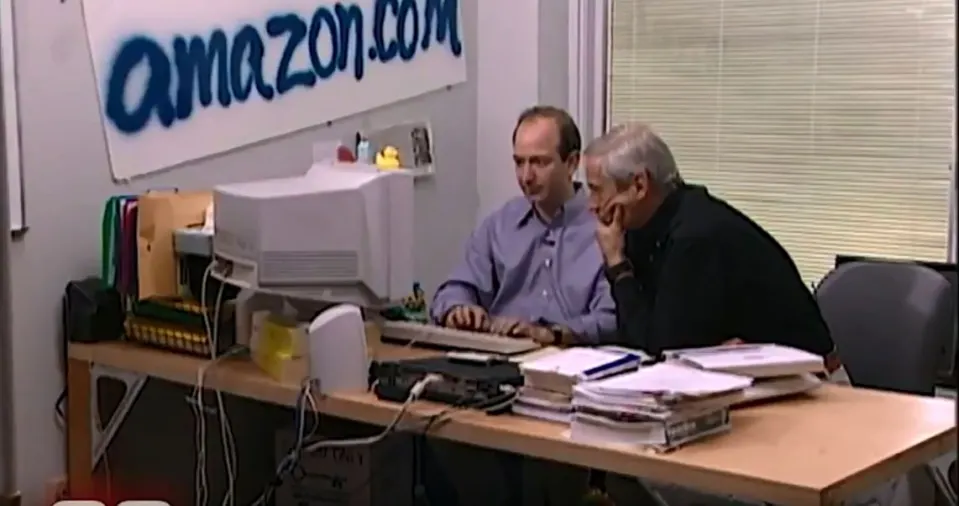
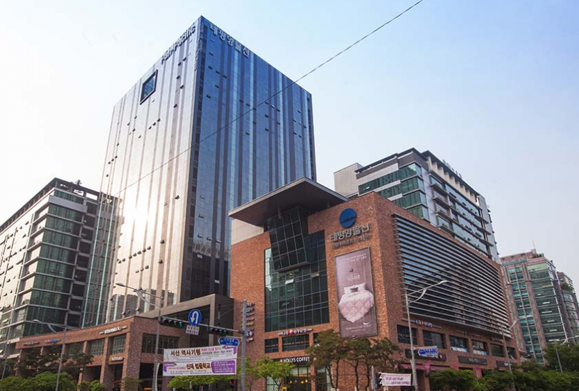
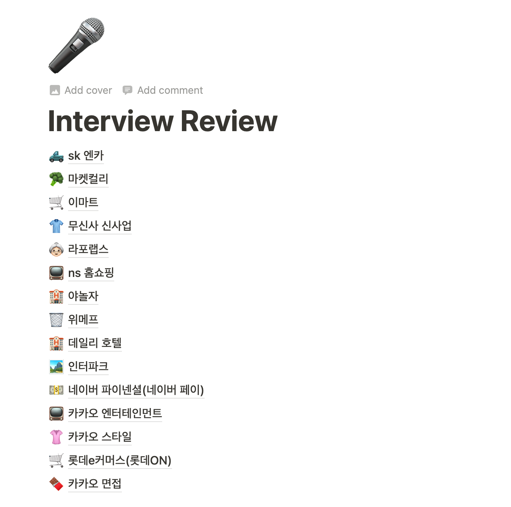
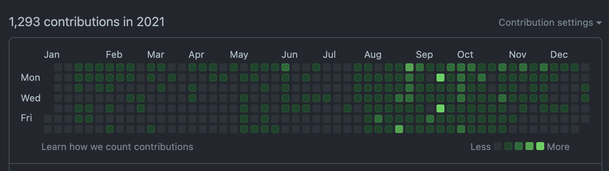
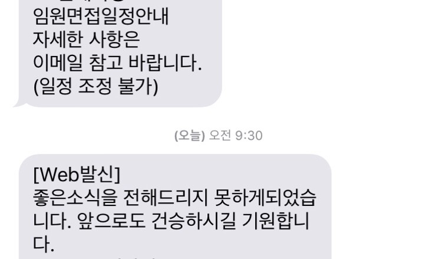

# 비전공자가 개발자가 되기까지

---

## 제 커리어를 간단히 말씀드리자면...

---

### 신생 스타트업(8개월)

- 3명일때 입사, 5명이 되고 회사가 망함(투자를 못받음)
- git repo부터 시작해서 user site, admin site Front-end를 혼자 담당
  - 여기서 webpack, react 등 혼자 다하면서 이것저것 많이 알게 됨
  - 혼자 공부를 많이 했고, 혼자 공부하는 법을 스스로 좀 터득하게 됨
- 하지만 회사가 망하고 나서, 직업의 안정이 주는 소중함을 알게 됨

---

### 중소기업(2년)

- 200여 명 규모의 탄탄한 중소기업
- Front-end application이 커서 많은 것을 배움(FE 개발자만 20여 명)
- 2년동안 인턴 사원 6명, 한 파트(feature)의 리더로 일 함
- 2년 후, 현 회사로 이직
  - 비즈니스 규모가 큰 회사에서 경험을 쌓아 보고 싶다.

---

### 대기업(1년 다 되감)
- 대기업 복지와 여유를 누리며 살아가는 중...
- 요즘 관심사는 `unit test`와 `functional programming`

---

## 취업 준비는 어떻게 해야하나

---
### 1. 가고 싶은 회사 정하기
- 도메인(서비스 분야)
  - ex) 커머스, 미디어(웹툰, ott)...

- 기술(stack)
  - ex) 리액트, 뷰, 스프링 등등..

- 남들이 뭐라고 해도, 자기 기준 좋은 회사가 좋은 회사임
- 커리어가 쌓일 수록 달라질 수 있음!

---

### 2. 그 회사가 무엇을 원하는지/하는지 살펴보기

- [네이버 테크 직군 신입 채용](https://linkareer.com/activity/90744)
- [[크리마 (크리마팩토리, 크리마랩)] Junior Software Engineer (신입가능) 채용 | 원티드](https://www.wanted.co.kr/wd/8138)

- [토스채용](https://toss.im/career/job-detail?job_id=4907018003&isNewCareer=false)
---

### 서류전형
- 자기가 어필하고 싶은 것들 위주로 담백하게 쓰면 됨
- 오버해서 쓰면 면접때 되돌아옴
- 오탈자/가독성 등 기본은 지키자!

---
### 알고리즘
- 이론 공부 후, 혼자 많이 풀어보는 수 밖에...
- 수능 수학 풀듯이 풀고, 오답노트, 풀고, 오답노트의 반복
- 강의, 스터디 혹은 주변에 잘하는 친구가 있다면 풀이법 공유
- (저한테는) 제일 재미 없고, 성장이 더딘 영역... 
---
### 과제전형
- 신입한테도 할지 모르겠지만...
- 평소에 코딩 많이 해보고, 구조 많이 짜봐야 바로 잘 할 수 있음
- 갑자기 잘하긴 힘듬... 정답이 없어서 겁 먹을 필요는 없음
--- 
### 1차 면접(실무 면접, 기술 면접)
- (학부 생일 경우) DB, OS, Network 등 컴퓨터 공학 지식을 물어봄 
  - 그래도 취업을 떠나서 틈틈이 기초 지식은 공부하는 게 좋습니다! 
- 비전공인걸 감안하고 서류를 통과시킨 거라면 프로젝트, Front-end 기초 지식을 물어봄
- 공부를 해서 들어가야하는 면접
- 가장 중요한 것은 내가 이력서에 작성한 기술들에 대해서는 이야기할 수 있어야함

---
### 저는 React, scss(sass), webpack, javascript를
### 활용하여 SPA 서비스인 맛집 지도를 개발한 경험이 있습니다.

---
> 저는 React, scss(sass), webpack, javascript를 활용하여 SPA 서비스인 맛집 지도를 개발한 경험이 있습니다.

- React는 어떤 장점이 있나요?
  - React 단점은 없나요? / state와 props는 무엇인가요? / 다른 프레임워크는 사용해봤나요? / virtual DOM은 뭔가요? / 기존 방식들은 무엇이 문제였을까요?

- scss는 무엇이죠?
  - css랑 뭐가 다르나요? / trade-off도 있을텐데요?
  
- webpack은 왜 필요하죠?
  - 직접 설정해본 경험은 있나요? / babel은 아시나요?
---

1차 면접은 꼬리 물기 질문이 많이 들어옴
- 완벽히 모든 것을 방어할 순 없지만 그래도 공부를 많이 해서 대답을 잘하길 바람
- 1 depth 대답을 못하면, 혹은 정확한 대답을 못하면 모른다고 생각을 함
- 차라리 진짜 모르면 '모릅니다.'라고 이야기를 하는 게 맞음

---
1차 면접은 '답이 있는 질문'과 '없는 질문'으로 나눠져 있음
- (어느 정도) 답이 있는 질문
  - state와 props는 무엇인가요?
  - react hook은 무엇인가요? 언제 사용하나요?
  - 신입 기준에서 기술적인 질문들은 답이 어느 정도 있다고 봄
    - 경력직은 또 다름

---

답이 있는 질문에 대해 대답을 잘하기 위해서
공부를 열심히 함.

그리고 저는 제가 사용하는 용어가 입에 붙을 수 있게
샤워할때마다 말하는 연습을 함.

---
- 답이 없는 질문
  - 혹시 ~~~한 이견차이가 발생하면 어떤 식으로 해결했나요?
  - 코드리뷰 자주 하셨어요? 기분이 어떠셨어요?
  - 혹시 일하다가 가장 스트레스 받을 때는 언제에요? 어떻게 해소하셨어요?
  - 우리 서비스 뭐가 좋았어요? 왜 여기서 일하고 싶나요? 
  - 어떤 사람이 가장 잘맞고, 어떤 사람이랑 좀 일하기 싫었나요?
  - 프로젝트하다가 힘든 건 없었나요?
---

답이 없는 질문에 대한 대답을 잘하기 위해
저는 질문에 대한 준비를 하지 않음.

평소에 자기 기준과 생각 정리를 잘해둠.

---

### 1차 면접은 결국,
### 우리 팀에 들어와서 적응 잘할 수 있는
### 앞으로 몇 년 뒤 잘 성장할 수 있는, 성장 가능성 있는 사람을 '현재 기준'으로 판단
---
### 2차 면접(인성 면접, 임원 면접, 대표 면접)
- 캐주얼한 질문들이 많이 들어옴
  - 평소에 우리 회사 이미지 어떤가요?
  - 우리 회사 서비스 많이 활용하나요?
  - 쇼핑은 많이 하나요?
- 적당히 솔직하게 대답하는 게 중요한 면접
- 정말 가고 싶은 회사라면 회사 조사 많이 해가면 플러스 점수가 될 수 밖에 없음
- 오너, 임원 입장에서 우리 회사에 큰 괌심을 주는 건 매우 기쁜 일
- 약간의 패기(?), 무리수는 안됨
---
### 2차 면접은 결국,
### 일을 잘할 거라고 실무진(1차 면접)에서 통과시켰으니
### 정말 우리 회사랑 잘 맞을까? 우리 회사에 적응을 잘할 수 있을까? 
### 흔히들 말하는 컬쳐핏을 봄
(하지만 그렇다고 ~~인이 될 필욘 절대 없음)

---

### 면접 후,

- 면접은 잘본 면접이든 아닌 면접이든 무조건 복기
  - 1차 면접에서 대답 못한 질문들 다시 찾아 보기
  - 면접에서 반응이 안좋았던 답에 대해 복기

---

### 기업 유형에 따라 조금씩 다른 부분
---
- 스타트업
  - 이왕이면 당장 1인분은 했으면 좋겠음
  - 성향상 조금 더 능동적이고, 스스로 학습을 잘했으면 좋겠음(환경의 문제)
  - 대신 이것저것 해볼 수 있는 기회는 많음
  - 사수가 없을 수도 있음(이건 득실 판단이 불가함)
    - 사수가 내가 기대한 사수가 아니라면?

---

- 대기업
  - 몇 년 뒤를 바라보고 사람을 뽑음
  - 아무래도 위에 많은 선배 개발자와 절차가 있어 업무 자유도가 권한은 좀 적을 수 있음
    - 심지어 일을 작게 작게 나눠서 함
    - ex) 검색 팀, 추천 팀, 상품 팀, 인프라... 등등..
  - 같은 일을 하는 사람이 많음
  - 어쨋거나 안정적임
---
- 중소기업
  - 대기업 + 스타트업
  - 스타트업보다 안정적인 건 장점
  - 캐시카우가 명확한 회사면 조금 답답할 수 있음
    - 새로운 시도를 안하는 경우가 많음
  - 복지, 처우가 애매함...

---

### 기업 평판(후기) 알아보기

- 잡플래닛
- 크레딧잡
- 블라인드
  - 규모가 작은 중소기업, 스타트업은 얼추 맞음
  - 대기업은 진리의 부바부(부서 by 부서)
    - 삼성전자 그렇다던데? 응, 우리 회사 임직원 10만 명
    - 전체적인 분위기만 보면 되지, 디테일을 따질 필욘 없음
  - 퇴사율이 높으면 눈 여겨 봐야함 
    - 스타트업은 어쩔 수 없음 
--- 

## 내가 해왔던 것 

---
### 1. 자기 기준 명확히 하기
   - 연봉 3000만원 이하면 지원 안한다.
   - CTO만 있으면 일단 입사한다.
   - 회사 네임벨류 좋으면 일단 입사한다.
   - 등등..

---
### 2. 꾸준히, 스스로 성장하기
- 새로 알게 된 것 기록하기
- 대신 기록을 위한 기록은 하지 않기

---

### 3. 면접 기회 있으면 무조건 가기!
- 경험만큼 중요한 건 없음
- 면접에 많이 들어갈수록 면접에 능숙해진 자신을 발견할 수 있음
  - 말도 잘하게 됨
  - 당황도 안함
    - 어디서 들어본 질문임

---
### 4. 채용 공고 면밀히 보기
- 나도 이력서 정성 들여 쓰는데, 너희들도 정성 들여서 써야지!
- 좋아하는 키워드와 싫어하는 키워드가 있는지 살펴보기
- 최근 업데이트 반영은 잘 되었는지? 
---

### 5. 건강한 몸, 건강한 멘탈 관리

- 건승하기! 
- 나만 손해는 아니다! 훌륭한 인재를 알아보지 못하다니!!!
- 정신 승리 후, 면접 복기

---
## Q&A

--- 

