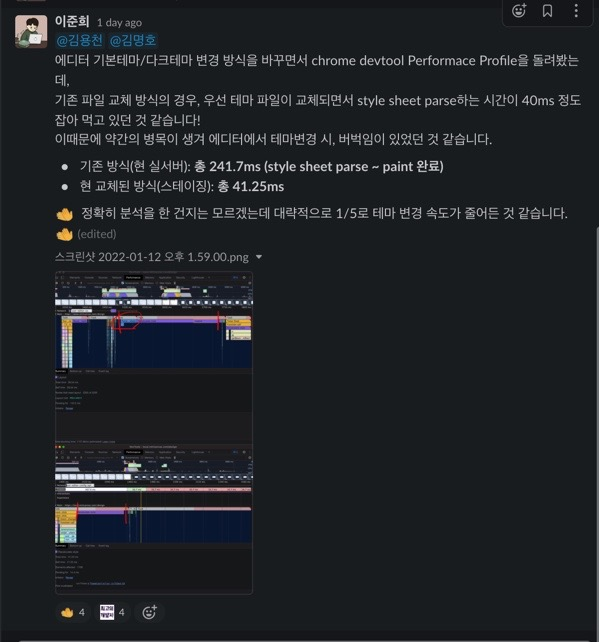

# 미리디(미리캔버스)

> '미리디'라는 회사의 프로덕트 중 웹 디자인 툴인 ['미리캔버스'](http://www.miricanvas.com/design)의 UI 컴포넌트 개발을 주로 하였습니다.

# theme 교체 방식 개선

- 

## 미리캔버스 유료화 feature 개발

- 기존 무료 서비스에서 유료화 전환
- 프론트엔드 챕터 리딩(챕터원 2명과 함께 개발)
- https://yozm.wishket.com/magazine/detail/2104/

## /workspace 개발 (2021.04 ~ current)

- [워크스페이스 - 미리캔버스](http://www.miricanvas.com/workspace)

  - 내 디자인 개발
    
    - list view 제외한 React 컴포넌트 개발
    - 더보기 메뉴, 팝업 등
    - javascript 작업
  - 내 드라이브 개발
    
    - list view 제외한 컴포넌트 개발
    - 더보기 메뉴, 팝업 등
    - javascript 작업
  - 브랜드 키트 개발
    
    - b2b용 엔터프라이즈 기능
      - 사용자 요금제에 따른 브랜드 키트 제한 개수, 각각 항목의 제한 개수 등에 대한 제약 처리

- 사용자 디자인 및 리소스 관리 페이지(workspace) 리뉴얼 (zero-base에서 개발)
- React.js, React-Router-Dom 활용하여 개발

## chart 요소 관련 기능 중 data grid 개발 (2021.01 ~ 2021.03)

- 차트 데이터 그리드 오픈소스(Jspreadsheet) 커스텀 및 프로덕션 적용
- [Jspreadsheet open source 중복 코드 제거 후, pr](https://jhlee910609.github.io/til_everything/docs/me/Open%20source%20contribution#jspread-sheet) 하여 contributor가 됨

## GIF 요소 추가 (2020.10 ~ 2020.12)

- 디자인 요소(오브젝트) 중 하나인 GIF 요소를 추가하여 사용자들이 움직이는 요소를 활용할 수 있도록 함
- 일반 요소와 달리 crop된 GIF에 대한 처리 css로 방식 바꿈
- GIF 요소, 일반 사용자 속성창 및 관리자 속성창(내부 디자이너 사용) 개발

## SEO 개선 (2020.9 ~ 2020.11)

- SEO가 적용되어 있지 않은 모든 미리캔버스 웹 페이지에 SEO 적용
- vanilla.js로 구현된 관계로 순수 구현 (Node.js, express, Mustache)
- 3개월(20.09 ~ 20.11) 동안 170만건의 노출 수(구글 서치 기준)를 기록
- [site:www.miricanvas.com - Google 검색](https://www.google.com/search?q=site%3Awww.miricanvas.com&oq=site%3Awww.miricanvas.com&aqs=chrome..69i57j69i58.4154j0j7&sourceid=chrome&ie=UTF-8)

## intersection-observer 도입 (2020.08 ~ current)

- 웹 페이지 로딩 속도 향상을 위해 Intersection Observer를 활용하여 Lazy Loading 하도록 개선 및 전사 공유
- LazyImageComponent 개발 후, img tag 활용하는 곳에 점진적 적용
- /templates 웹 페이지 초기 로딩 속도 향상
  - 11.55s -> 5.14s
  - image resource load 55mb -> 6mb로 축소

## /templates 개발 (2020.08)

- [템플릿 - 미리캔버스](https://www.miricanvas.com/templates) 개발
- router부터 zero base에서 개발하였고, 고객 이탈율 0%의 페이지 개발 (데스크탑/태블릿/모바일 반응형)

## 인턴 개발자 멘토링 (2020.6 ~ current)

- 미리캔버스 React.js 도입기 및 React.js 기초 교육
- 인턴 개발자들과 함께 업무하며 1:1 멘토링 진행

## React.js 도입 (2020.01 ~ 2020.02)

- vanilla.js로만 되어 있던 환경에 React.js 도입을 통해 개발 생산성 향샹에 기여
- 전사 개발자 대상으로 React.js 도입기 및 기초 교육 실시
