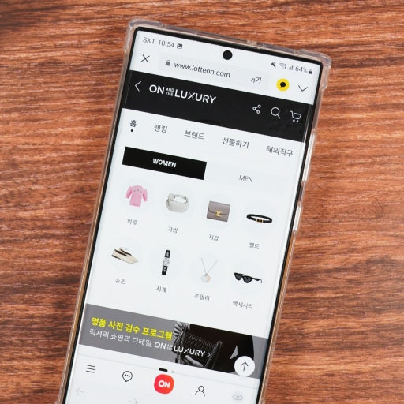
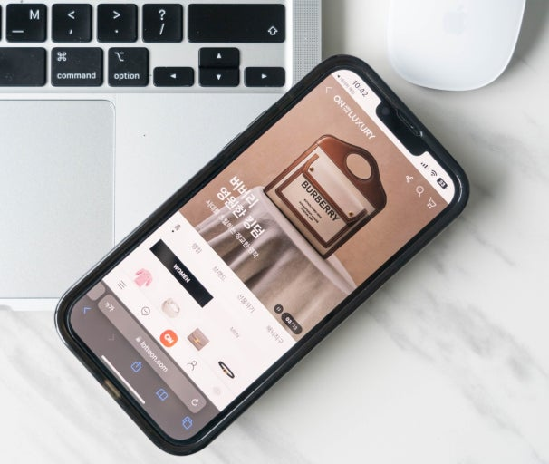
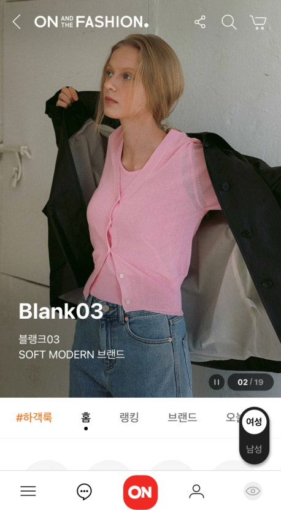
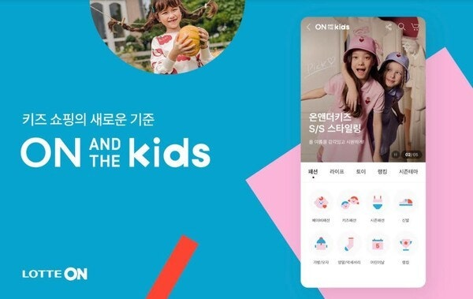

# 롯데e커머스 (롯데ON)

          

## 기본 정보

- **재직 기간**: 2022.03 ~ 현재 (3년 4개월)
- **부서**: 롯데쇼핑 e커머스사업본부 전시개발팀
- **역할**: Front-end Developer
- **주요 업무**: 롯데ON 상품 전시 및 검색 프론트엔드 개발

## 성과 및 기여도

### 성능 개선

- **[[bundle-size-50%-감소]]**
- **검색 필터 로딩 시간 7% 단축** (1841ms → 1711ms)

### 비즈니스 기여

- **버티컬 서비스 론칭**으로 새로운 매출 채널 구축
- **검색 성능 개선**으로 사용자 경험 향상 및 전환율 개선

### 기술적 기여

- 레거시 코드 개선 및 최신 기술 도입
- 컴포넌트 재사용성 향상
- 개발 생산성 증대를 위한 툴 개선

## 주요 프로젝트 및 업무

### 1. 버티컬 신규 서비스 개발 (2022.10~2023.05)

**매출과 직결된 버티컬 서비스 구축**

- **서비스 개발**

  - 온앤더럭셔리, 온앤더패션, 온앤더키즈 (서비스 종료)
  - [국내 숙소 예약 서비스](https://www.lotteon.com/m/display/shop/seltDpShop/59901?apiType=accommodation)

- **주요 기능**
  - 각 버티컬에 특화된 상품 전시 페이지
  - 카테고리별 맞춤형 UI/UX
  - 반응형 웹 디자인

  
  

  
  

### 2. 전시 영역 UI 개발 및 검색 필터 개선 (2024.03~현재)

**검색 성능 최적화 및 사용자 경험 개선**

#### 성능 최적화

- **React-Query Memory Caching** 활용하여 비동기 race condition 문제 해결
- **AbortController** 활용하여 request 취소로 rendering 최적화
- **필터 Component 최적화**
  - 필터 클릭 시에만 component rendering하도록 수정
  - 기존 visibility show/hide → DOM attach/detach로 개선
  - **초기 필터 open 시 로딩 시간 단축**: 1841ms → 1711ms

#### 기술적 개선사항

- React-Query를 통한 효율적인 데이터 캐싱
- 컴포넌트 lazy loading을 통한 초기 로딩 최적화
- 불필요한 re-rendering 방지

### 3. 레거시 개선 및 개발환경 개선

**6개월 간 롯데온 전시 총 페이지(매장) bundle size 50% 감소 달성**

#### 최적화 작업

- **무거운 Third-party Library 교체**

  - moment.js (67KB) → day.js (2KB) - 97% 감소
  - lodash (71KB) → lodash.es (24KB) - 66% 감소
  - lottie (158KB) → lottie-light-web (34KB) - 78% 감소

- **불필요한 코드 제거**
  - 불필요한 dynamic import component 조사 후 모두 제거
  - PO와 협업하여 미사용 페이지 전부 제거

#### 성과

| 구분                  | 디바이스 | Before  | After   | 감소량  | 감소율 |
| --------------------- | -------- | ------- | ------- | ------- | ------ |
| 총 페이지(매장)       | PC       | 64.44MB | 29.94MB | -34.5MB | -53%   |
| 총 페이지(매장)       | Mobile   | 39.98MB | 28.88MB | -11.1MB | -24.4% |
| 사내 공용 node module | PC       | 2.16MB  | 1.46MB  | -0.7MB  | -32.4% |
| 사내 공용 node module | Mobile   | 3.73MB  | 2.82MB  | -0.91MB | -24.4% |

### 4. 업무 효율을 위한 Dashboard 개발

- 서비스 운영 효율화를 위한 사내 전시 관리 대시보드 개발
- 운영자가 실시간으로 데이터 모니터링 및 노출 영역 제어 가능하도록 구현
- React + Recoil 기반 상태관리 및 GraphQL API 연동

### 5. 프론트엔드 AI 툴 도입을 통한 DX 개선

- Cursor AI, Codeium 등 AI 기반 코드 제안 툴을 프론트엔드 워크플로우에 도입
- 반복적 코드 패턴 자동화 및 리뷰 효율 개선
- 팀 내 개발 생산성 및 품질 향상에 기여

## 학습 및 성장

### 대규모 서비스 경험

- **롯데ON**이라는 대규모 이커머스 서비스 개발 경험

### 팀워크 및 협업

- **PO와의 긴밀한 협업**을 통한 비즈니스 요구사항 이해
- 크로스 플랫폼(PC/Mobile) 개발 경험

### 기술적 성장

- 번들 최적화 및 성능 튜닝 전문성 확보
- 모던 프론트엔드 개발 환경 구축 경험

[//begin]: # "Autogenerated link references for markdown compatibility"
[bundle-size-50%-감소]: ../../front-end/bundler/bundle-size-%EC%B5%9C%EC%A0%81%ED%99%94-50%ED%8D%BC%EC%84%BC%ED%8A%B8-%EA%B0%90%EC%86%8C-%EB%8B%AC%EC%84%B1%EA%B8%B0.md "Bundle Size 최적화로 50% 감소 달성하기"
[//end]: # "Autogenerated link references"
