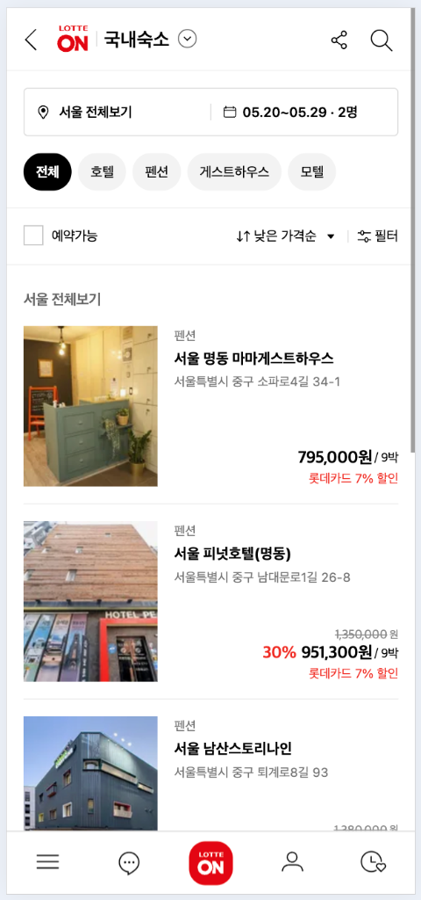
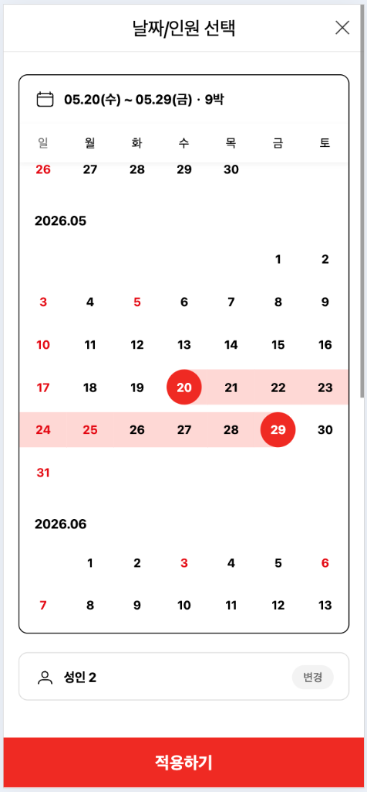
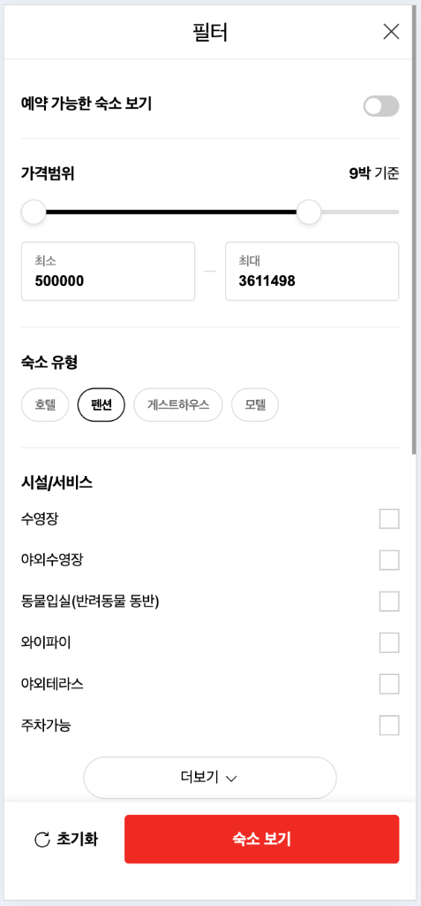

# 롯데e커머스 (롯데ON)

> **프론트엔드 개발자** | 2022.03 ~ 2025.12. (3년 9개월)
>
> "대규모 사용자 환경의 **프론트엔드 성능 최적화**와 **레거시 개선**을 주도하며, 비즈니스 성장을 함께 도모하는 개발자입니다."

## 🏆 핵심 성과

- **성능 개선**: 불필요한 의존성 제거 및 트리쉐이킹으로 **번들 사이즈 53% 감소** (64MB → 29MB).
- **최적화**: 검색 필터 렌더링 로직 개선으로 **초기 로딩 속도 7% 단축** (사용자 경험 개선).
- **비즈니스**: 온앤더럭셔리/패션 등 **신규 버티컬 서비스 론칭** 및 **여행/숙박 카테고리 확장** 주도.

## 🛠 기술 스택

     

---

## 📂 주요 프로젝트

### 1. 여행/숙박 예약 서비스 론칭

_2024.04 ~ 2024.07_

> 롯데ON 내 신규 여행 카테고리를 확장하기 위해 숙박 검색 및 탐색 시스템을 구축한 프로젝트입니다.

**과제 및 해결:**

- **검색 및 탐색 기능**: 1명의 동료 개발자와 협업하여 숙박 검색, 필터링, 날짜 선택 등 핵심 인터페이스 개발.
- **DX 및 병렬 개발**: 백엔드 API 지연 문제를 해결하기 위해 **MSW + Faker.js + Copilot** 기반의 Mocking 환경을 선제적으로 구축하여 개발 효율 극대화.

**성과:**

- **적기 서비스 론칭**: 초기 성능 최적화(LCP 2.1초 달성)를 포함하여 목표 일정 내 안정적으로 서비스를 론칭.
- **사내 지식 공유**: 효율적인 Mocking 기반 프론트엔드 개발 프로세스를 정리하여 사내 기술 세션 발표 및 가이드라인 제안.
- **서비스 스크린샷**:
  

    
    
    
  

### 2. 버티컬 신규 서비스 개발 및 론칭

_2022.10 ~ 2023.05_

> 롯데ON 내의 전문관(온앤더럭셔리, 온앤더패션 등)을 신규 구축하여 타겟 사용자층을 확장한 프로젝트입니다.

**과제 및 해결:**

- **유연한 UI 아키텍처**: 다양한 버티컬 카테고리에 대응할 수 있는 **반응형 웹 템플릿** 설계.
- **컴포넌트 재사용성**: 각 전문관별 상이한 기획 요건을 공통 컴포넌트와 확장 패턴으로 해결하여 개발 효율성 증대.

**성과:**

- **비즈니스 성장**: 신규 매출 파이프라인 확보 및 플랫폼 전반의 트래픽 증대 기여.
- **서비스 스크린샷**:
  

    
    
  

  

    
    
  

### 3. AI 툴을 활용한 DX (개발자 경험) 개선

> 개발 생산성을 저해하는 레거시 환경을 개선하고, AI 도구를 도입하여 팀 전체의 효율을 높였습니다.

**주요 활동:**

- **AI 도구 도입**: **Cursor AI**를 팀 내 도입하고 전용 규칙(Rules)을 설정하여 코드 작성 시간 단축 및 리뷰 효율화.

**성과:**

- **업무 효율 증대**: 전시 기획/개발 업무 효율 비약적 증대.

### 4. 전시 영역 레거시 개선 및 성능 최적화

> CSR 환경에서의 무거운 번들 사이즈 문제를 해결하여 사용자 경험을 개선했습니다.

**문제 정의:**

- 거대한 레거시 코드와 무분별한 라이브러리 사용으로 인해 초기 로딩 속도 저하.

**해결 방안:**

- **번들 최적화**: Moment.js를 Day.js로 교체, lodash -> lodash/es로 교체, 미사용 코드와 모듈 제거, Dynamic Import 적용.

**결과:**

- **번들 사이즈 감소**: PC **53%**, 모바일 **24%** 감소. 초기 로딩 속도 개선은 미미.

---

### [참고 링크]

- [번들 사이즈 최적화 성공기](../../front-end/bundler/bundle-size-%EC%B5%9C%EC%A0%81%ED%99%94-50%ED%8D%BC%EC%84%BC%ED%8A%B8-%EA%B0%90%EC%86%8C-%EB%8B%AC%EC%84%B1%EA%B8%B0.md)
