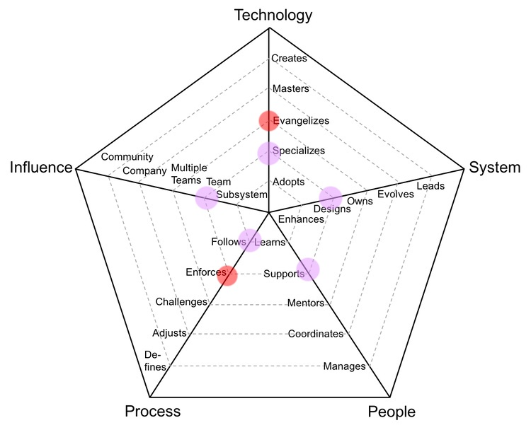

# 좋은 개발자 되기

> 좋은 개발자가 되자!
>
> - 함께 일하고 싶은 동료

## 0. 어떤 개발자가 되고 싶은가?

- [Engineering Ladders](http://www.engineeringladders.com/)
  - 오픈소스 프로젝트 멘토분께서 알려주신 개발자 커리어 Framework
  - 내 미래를 고민하는데 굉장히 큰 도움이 되었다.🙏
    
  - 보라색 점은 현 상황, 빨간 점은 키우고 싶은 능력(레벨)이다.
- 아직은 Newbie Developer

## 1. 개발 잘하는 개발자가 되기

## 2. 함께 일하고 싶은 동료가 되기

- [개발자의 다양성-개발만 잘한다고 좋은 개발자?](<https://s3.ap-northeast-2.amazonaws.com/kcd-2019/resources/track2Session4(%E1%84%80%E1%85%B5%E1%86%B7%E1%84%8B%E1%85%AD%E1%84%92%E1%85%A1%E1%86%AB_reackKorea)%E1%84%8C%E1%85%A9%E1%87%82%E1%84%8B%E1%85%B3%E1%86%AB%E1%84%80%E1%85%A2%E1%84%87%E1%85%A1%E1%86%AF%E1%84%8C%E1%85%A1_%E1%84%83%E1%85%A1%E1%84%8B%E1%85%A3%E1%86%BC%E1%84%89%E1%85%A5%E1%86%BC.pdf>)
- [일잘러의 다섯가지 특징](https://brunch.co.kr/@curahee/44)
  - 개발자라고 일 잘하는 기준이 다른 직무랑 다를까? 일 잘하는 사람들의 공통점을 고민해보자.
